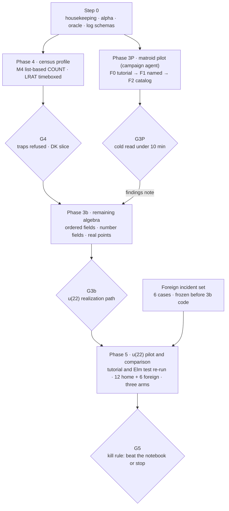

# GP 0.50 — post-G3a handoff: pilot-first sequencing through G5

**Date:** 2026-10-04 · **Owner:** Will

## 0. Authority and summary

GP 0.50 keeps its architecture and changes its order: a 3a-native campaign pilot (Phase 3P) now runs beside Phase 4, so the core meets a live campaign before 3b is built.

**Owner:** Will. **Applies to:** workspace `master` / `codex/phase-0`, from G3a onward. **Authority:** this document amends the post-G2 handoff, Addendum A, the rev 3 packet and `DECISIONS.md`; where they conflict, this document wins. Copy §1 into `DECISIONS.md` verbatim.

Everything not amended here stands: the Kernel pin, the ownership rule (0.50 checks, never constructs), the Mathlib-free Kernel, the existing not-lists and the G5 kill rule.

**Plain-language summary (the model for the top of `STATUS.md`):**

- Phases 0–3a built a small proved kernel and a real algebraic profile. G3a-0 showed what GP adds over plain Lean: computed reach, refusal of meaning-changing restatements, and custody.
- No live campaign has used 0.50 yet. The first planned use was Phase 5, after the census profile and the hardest algebra, which put the only test of the project's purpose last.
- This handoff moves the campaign-shaped parts of Phase 5 forward onto 3a. A small real campaign on matroid characteristic sets is run by a separate campaign agent from a campaign statement, and Will reads the result cold.
- Phase 4 continues. Phase 3b follows G4 and absorbs the pilot's findings. G5's comparison gains foreign incidents so it cannot be won on home ground.
- Custody work gets a budget.

## 1. Decisions (ratified by Will, 2026-10-04)

Ten decisions; copy this section into `DECISIONS.md` verbatim.

1. **Alpha publication approved.** Publish `v0.50.0-alpha` by steps 1–4 of `reports/ALPHA-STAGING.md`. Re-check first: the local-path ratchet is at zero and `gp50` is green at the tag.
2. **Oracle home before the workspace goes private.** `oracle/PIN.json` pins workspace commit `ac41557`, while public `grandportage` tag `v0.37.0` is `8ccc38e`. If the trees match for every file the harnesses read, repin to the public tag; otherwise publish the oracle snapshot as a release asset with its SHA-256 in the pin. The workspace stays public until this is done.
3. **Phase 3P inserted.** A matroid characteristic-set micro-pilot (§4) runs beside Phase 4. It takes over rev 3 Phase 5 items 1–2 (campaign statement format, derived views, tutorial) and runs the Elm test early on 3a. Phase 5 repeats both on u(22).
4. **Campaign agent separation.** A campaign agent that is not the builder runs the pilot from the campaign statement and the CLI alone. The builder fixes the gaps it reports and never authors campaign claims.
5. **Phase 4 continues per M4**, with list-based COUNT. The LRAT-Catcher port is timeboxed; the fallback is Lean core's LRAT checker (§5).
6. **G5 comparison set:** 12 home incidents plus 6 foreign incidents, the foreign set selected and frozen before 3b code begins, results reported separately (§7).
7. **Custody budget** as in §8.
8. **Campaign selection filter** (standing guidance). Point GP at campaigns where (i) no cheap authoritative verifier exists, (ii) claims cross worlds (ℚ, F_p, ℝ, number fields) and (iii) the campaign runs long enough for custody to matter.
9. **The certificate-to-Lean emitter is a named deliverable.** It is GP's most likely durable form: given a certificate, emit the Lean theorem at the widest scope the certificate supports. Pilot tailings carry a Lean warrant for each held claim within generator coverage, and G3P reports that coverage.
10. **Outside contact stays Will's** (A8). After publication the builder prepares a one-page reviewer brief for the alpha.

## 2. Sequence

Two tracks run from Step 0: the builder continues Phase 4 while a separate campaign agent runs the 3P pilot, and G3P's findings feed the 3b design.

Phase 3P and the foreign-incident freeze are new. Every other box was already in the plan, in the same order.

## 3. Step 0 — housekeeping and logs (before 3P starts)

Step 0 is small and finishes before the campaign agent starts; its two log schemas are what make the pilot measurable.

- [ ] **`STATUS.md`:** record G3a ratification, the alpha hold and its release, local-path removal, Phase 4 opening and this handoff. Add a test that `STATUS.md` names the latest gate ratified in `DECISIONS.md`.
- [ ] **Master `README.md`:** drop "Phase 3 is next"; point at `STATUS.md`.
- [ ] **Alpha publication** (decision 1) and **oracle home** (decision 2).
- [ ] **Cost log schema**, moved forward from the Phase 5 prerequisites: wall time, tokens, agent turns, catches, false refusals and expensive near-misses, per task. Logging starts on 3P day one.
- [ ] **Friction log schema:** every refusal the campaign agent meets is classified *useful* (stopped a real error), *false* (sound claim refused) or *ergonomic* (right refusal, unhelpful message). This makes KILL-CRITERIA A5 prospective.

## 4. Phase 3P — matroid characteristic-set pilot

Phase 3P runs a small real campaign on 3a: determine the characteristic sets of a bounded family of rank-3 matroids, with every result held at its computed reach and read cold by Will.

### 4.1 Why this target

- **It is exactly a 3a scope.** A matroid M is realizable over some field of characteristic p iff its realization system is nonempty over the algebraic closure of F_p (ACF_p completeness). So the characteristic set χ(M) is a characteristic-set scope; dependent 3-sets give equations and bases give guards.
- **Reach displays a known theorem.** χ(M) is either cofinite and contains 0, or finite and excludes 0 (Rado; Vámos; Oxley, *Matroid Theory*, characteristic sets). A ℚ non-realizability certificate with denominators D reaches every characteristic not dividing D. A rational realization should reach 0 and all but finitely many p. The ledger should show the dichotomy without being told it.
- **Home turf.** Matroid realizability is an existing differential fixture, is adjacent to ARR15, and has answer keys for the canonical cases.

### 4.2 Campaign statement (Appendix E v0)

- **Goal claim:** for each M in the family, χ(M) fully held. That means its char-0 status, its exceptional prime set, and a held status at each exceptional prime.
- **Profile:** 3a only. **Admitted moves:** C1/C3 certificates (including mod-p replay), C2 points, the char-p point checker if admitted (§4.4), R1–R4, the bridge rule.
- **Done condition:** every M has χ(M) fully held, or each open item is tagged *closable in principle* or *no complete method*.
- **Family, staged:**
    - **F0 (tutorial):** Fano F7 and non-Fano F7⁻. Expected: χ(F7) = {2}; χ(F7⁻) = every characteristic except 2.
    - **F1:** about 10 named rank-3 matroids whose characteristic sets a primary source states. The campaign agent chooses them and cites each answer, tagged `[VERIFY]` until checked. Include non-Pappus, whose characteristic set should be empty.
    - **F2 (stretch):** all simple rank-3 matroids on at most 8 elements from a catalog. The generator is labelled trusted and catalog completeness is an OPEN premise. Go to 9 elements only if F2 is cheap.

### 4.3 Encoding

- A rank-3 matroid on n points becomes a 3×n matrix of unknowns. Equations are the determinants of non-bases; guards are the determinants of bases.
- Projective normalization (fixing a frame) is a WLOG. Record it as a named premise `ENCODING-FRAME`; discharge it in Lean if cheap, otherwise leave it visibly OPEN. This is the M4 trap "an encoding without a correctness warrant", met at small scale.
- The encoder is deterministic and its output digest is bound into every claim.

### 4.4 Checker gaps to settle first

1. **Points over finite fields.** Confirm whether 3a can mint nonemptiness at a single characteristic p from a point over F_p[a]/(m). If not, admit one checker under the standard admission bar: Mathlib soundness, controls, a TCB entry and a certificate that m is irreducible mod p.
2. **Mod-p-only emptiness.** Confirm that a certificate whose rational residual vanishes mod p but not over ℚ mints EMPTY with reach exactly {p}. Non-Fano at p = 2 is the control.

Stop and ask if either needs a Kernel change or a new statement kind.

### 4.5 Roles

- **Campaign agent:** a separate session whose only inputs are the campaign statement, the CLI and this section. It searches freely with Singular, Macaulay2 or Sage (untrusted, campaign-op) and keeps the cost and friction logs.
- **Builder:** the CLI, the views, the checker gaps and fixes for reported problems. It never authors campaign claims or edits the ledger.
- **Will:** the cold read at G3P.

### 4.6 Minimal surface (CLI only)

Indicative commands: `claim`, `submit <receipt>`, `status` (held, open, refused, earned), `explain <claim>` (the licence tree), `frontier`, `tailings --export` and `emit-lean <claim>`. Every refusal message states what was refused, under which rule and scope, and the smallest fix. No MCP and no hooks.

### 4.7 Tutorial

A fifteen-minute script on F0, drafted as the Elm-guide-style first page of the future README. It uses at least one classic overclaim:

- "non-Fano is realizable in every characteristic", inferred from a rational realization and refused at characteristic 2 by reach;
- "Fano is realizable nowhere", inferred from a ℚ certificate that divides by 2 and refused at characteristic 2;
- realizability over ℚ claimed from a floating-point search and refused by exact replay.

It ends with one honest result, one tailing and one earned-but-unclaimed widening.

### 4.8 Deliverables

- the campaign statement file, the ledger and its derived views;
- a tailings export in source / reliability / completeness form;
- a Lean warrant file for held claims within generator coverage, with the coverage percentage;
- the tutorial draft, the cost log and the friction log;
- `PHASE-3P-REPORT.md` (at most 800 words).

### 4.9 Gate G3P

| Condition | Pass bar |
| --- | --- |
| Autonomy | The campaign agent completes F0 and F1 from the statement and CLI alone; every builder fix is logged |
| Elm test | Will reads the F1 ledger cold and states what is held, open, refused and earned in under 10 minutes |
| Correctness | F0 exact; zero disagreements with cited answer keys; no held result contradicts the Rado–Vámos dichotomy |
| Safety | Zero false ACCEPTs; Kernel pin unchanged |
| Measurement | Cost and friction logs complete; every refusal classified |

**On failure.** An ergonomic failure (Elm test missed, or refusals mostly *false* or *ergonomic*) means fixing surfaces before 3b, then reporting. A semantic failure, including any contradiction with the dichotomy, means report and stop. No new Kernel concepts or statement kinds to rescue the pilot.

**Interleaving.** Phase 4 checker work continues while the campaign agent runs. G3P should land before G4 but does not block it.

## 5. Phase 4 — census profile (amended)

Phase 4 proceeds as planned, with `docs/M4-CENSUS-SEMANTICS.md` as its design authority and three amendments.

- **M4 is adopted as written.** COUNT is list-based: k exact witnesses, distinct verified canonical forms, and a block-and-refute EXHAUSTIVE. The §5 must-refuse and must-accept table is the admission control set.
- **LRAT timebox.** Make one bounded attempt to port LRAT-Catcher from v4.30.0 to the v4.34.0-rc2 pin, targeting at most one builder day. If it isn't clean, fall back to Lean core's `Std.Tactic.BVDecide.LRAT` checker, re-checking `check_sound` and its native trust at rc2 per `TCB.md`. GP then composes cube covers itself as a `COVERAGE` premise per M4 §4, and LRAT-Catcher becomes *imitate*.
- **The pilot is the first customer.** Phase 4 must represent F2's catalog-completeness premise with an honest label (trusted generator, OPEN). Discharging it is not a G4 condition.

**Gate G4** is unchanged, plus one condition: the 3P ledger still replays unchanged after Phase 4 lands.

## 6. Phase 3b — remaining algebraic regimes (amended)

Phase 3b opens after G4 and after `PHASE-3P-REPORT.md`; its design is otherwise as in post-G2 §5.

- **First deliverable:** a one-page note on which 3P findings change 3b — surfaces, refusal messages, warrant emission and statement ergonomics. Write it before any 3b code.
- **Context truth, before code.** The 3a.1 reading ("true in every field of this characteristic") was sound only because 3a scopes are closed under algebraic closure. An ℝ atom is not characteristic-determined, so decide the ordered-statement question ((a) quantify over orderings, or (b) an ordered-field profile) with M1 first, as already planned.
- **G3b** is unchanged. The Cloquet and u(22) realization moves still need an admitted checker path.

## 7. Phase 5 and G5 (amended)

Phase 5 keeps the u(22) pilot and the kill rule; its comparison gains six foreign incidents so the result says something beyond GP's own error history.

- **Pilot.** The campaign statement format, views and tutorial now arrive in 3P. Phase 5 re-runs the tutorial and the Elm test on the u(22) ledger (census plus real algebraic), as rev 3 G5 requires.
- **Home set:** 12 incidents from `INCIDENT-INVENTORY.md`, stratified by class as before.
- **Foreign set:** 6 incidents from outside the inventory. Candidates are published or posted errors in AI-assisted computational mathematics, errors in other people's campaigns, and corrected or retracted computational claims. Each needs a computational claim, replayable exact inputs, and an error confirmed in a primary source.
- **Selection:** a separate agent with no access to `INCIDENT-INVENTORY.md` picks the foreign set against the written criteria above. The list is frozen and hashed before any 3b code, and Will approves it.
- **Reporting:** home and foreign results are reported separately. The rev 3 G5 thresholds apply to the combined 18. If the core does worse than the notebook arm on the foreign six, report that prominently even when the combined thresholds pass.
- **Kill rule unchanged:** if the core does not beat the notebook baseline, stop and reconsider; do not add features to rescue it.

## 8. Process

Post-G2 §8 carries over with a custody budget added, because custody work on custody artifacts is where effort has been leaking.

**Custody budget.**

- Each phase report states its share of custody-only commits: commits that change no checker, rule, profile, test semantics or campaign artifact. At 30% the tripwire fires: stop and report.
- A new receipt or audit family needs one line naming the soundness or reproduction failure it prevents. With no such line, don't add it.
- Update `STATUS.md` in the same commit as any gate record.
- Word caps are unchanged. Phase 3P targets 6,000 new words, with the tripwire at 9,000.

**Stop and ask Will if:**

- G3P fails semantically, or a held result contradicts the Rado–Vámos dichotomy;
- a 3P need requires a Kernel change or a new statement kind;
- the char-p point checker's soundness needs a non-standard axiom;
- a cited answer key and the ledger disagree;
- both the LRAT-Catcher port and the core-LRAT fallback fail;
- any public push beyond the approved alpha is needed.

**Not-list additions.** GP 0.50 will not:

- let the builder author or edit pilot campaign claims;
- add MCP or hook surfaces before G5 (unchanged);
- hold a COUNT claim over the F2 catalog before G4;
- answer a failed Elm test with anything beyond surface fixes.
