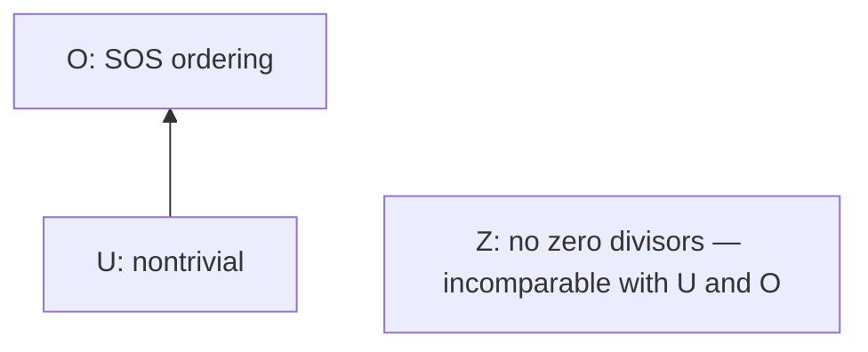

# Requirement profiles: the actual interfaces

Fix `Operations + Laws`. Compare **structural** requirements P <= Q when
for every such structure, Q implies P. Instance-specific derivations, equations,
and nonzero coefficient/goal hypotheses remain separate obligations; different
certificate statements cannot be compared by erasing them.

The catalog's structural profiles are U = `one != zero` (unit), O = existence
of the SOS `Ordering` interface, and Z = `NoZeroDivisors` (cancellation).
Z intentionally is not called an integral domain: the common Laws are smaller
than the full ring axioms, and Z does not exclude the zero algebra.

Every comparison is retained in `CancellationInterpreter.lean`:

| Comparison | Checked evidence |
|---|---|
| U < O | `ordered_nontrivial`; strictness: `modTwo_laws`, `modTwo_domain`, `modTwo_not_ordered` |
| U not <= Z | `zeroAlgebra_laws`, `zeroAlgebra_no_zero_divisors`, `zeroAlgebra_not_nontrivial` |
| Z not <= U | `modFour_laws`, `cancellation_deletion_countermodel`, `modFour_not_no_zero_divisors` |
| Z not <= O | `product_laws`, `product_order`, `product_not_domain` |
| O not <= Z | `modTwo_laws`, `modTwo_domain`, `modTwo_not_ordered` |

Thus these profiles are a poset, not a chain. If cancellation is packaged as
nontrivial + Z, its profile sits above U alongside O; those two remain
incomparable. That extra packaging assumption must be named, not inferred.

`cancellation_contradiction` starts with a syntactic derivation c*g=f, then
uses f=0, c!=0, Z, and g!=0. The integer sample is 2*x; the retained mod-4
point x=2 satisfies the derivation/equation and both nonzero hypotheses but
refutes cancellation. All Laws are discharged for integers, F2, and Z/4.
The existing exact polynomial membership checker replays the sample, and the
existing native identity verifier can prove x=0 from (2*x) over Q. It uses
invertibility of 2 through cofactor 1/2, not a new general domain verifier.
No dedicated cancellation interpreter is added to Python.

The 48 diagnostic premise subsets cover three interpreters (8/8/32). Positive
and deletion-countermodel names, including their supporting Laws/sample proofs,
are generated into `RequirementChecks.lean` and checked by the aggregate build;
a Python drift test binds that file to the catalog. Other cells remain UNKNOWN.

The four runtime reach tags describe canonical **field targets**, not this
structural poset. There is no faithful mapping on this catalog: Z/4, the zero
algebra, and the ordered product have no field tags at all. No third runtime
reach is earned here, so claiming an observed collision of two existing tags
would also be unjustified. A reach-only encoding loses these distinctions.
These elementary results make no novelty claim; standard-field adapters remain
future Mathlib work.
